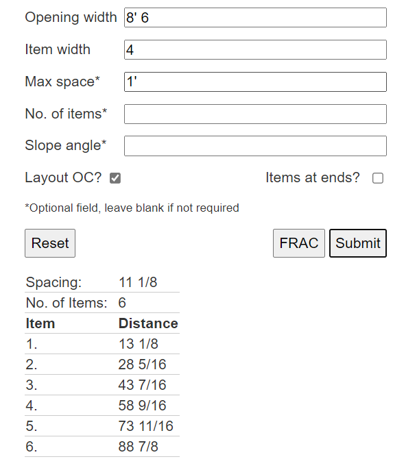

# EvenSpacer
## What does it do?
EvenSpacer finds the layout to equally space items within a given length
## Features
- Spaces items with the largest space up to and including the max space given
- Calculates a list of measurements to each item
- Measurements to the near side or center of the item
- Convert results between decimal, fractional, integer and feet and inches format
- Results are precise to 1/16th
- Option to begin and end with a space or with an item by checking 'Item at ends'
- Support for spacing on slopes

## How to
For spacing items on a slope, enter the angle of the slope. Opening width is measured along the slope, max space is measured at 0 degrees (level), see image below

## Demo
https://youtu.be/Y3OcOxW72qo
## Contact
Contact me framingcalc@gmail.com if you have any questions. Thank you.
